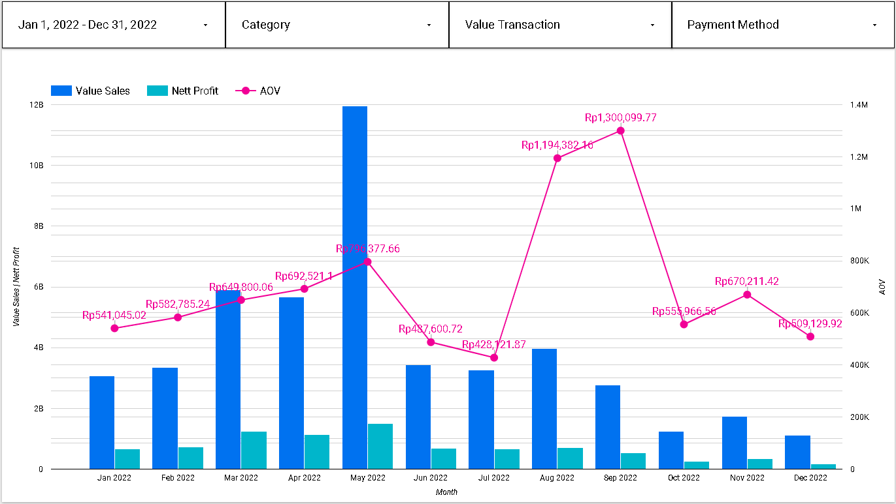

# Data Analysis with Google Looker Studio — A case from a Paskitan’s Largest E-Commerce

## Introduction


The case study is part#3 of the My Skill Data Analysis Bootcamp. By utilizing Google Looker Studio, we uncover the potential of this cutting-edge tool in deciphering valuable information about customer behavior, sales patterns, and market trends. Through this case study, we aim to showcase the practical applications of Google Looker Studio, its impact on decision-making processes, and its ability to drive business growth and success in the dynamic landscape of Pakistan’s e-commerce industry.

## Datasets
The native dataset is from Kaggle — Pakistan Largest E-Commerce Dataset with several with several modification. The dataset is then modified for the purpose of our analysis and can be found [here](https://docs.google.com/spreadsheets/d/1NCPbRu42OYhEFii2jDErNYPVkeXDIdFj_Z7F13Wwj-M/edit?usp=share_link)
- id: unique number or code of an order / id_order
- customer_id: customer unique number or code
- order_date: the date when transaction took place
- sku_id: product unique number or code (sku = stock keeping unit)
- price: amount of money on the price tag
- qty_ordered: number of product the customer purchased
- before_discount: total price of product (price x qty_ordered)
- discount_amount: total amount of discount of a product
- after_discount: the total value of product after being deducted with discount
- is_gross: a flag indicating a customer has not paid the order
- is_valid: a flag indicating a customer has paid the order
- is_net: a flag indicating the transaction is closed
- payment_id: unique number or code of a payment method
- sku_name: product name
- base_price: amount of money to pay attached on the price tag
- cogs: cost of good sold or the total cost to sell a product
- category: product category
- registered_date: the date when a customer registered as a member
- payment_method: method of payment used by customer to make purchase

## Problem Statement
Following up a join meeting in a company, a data analyst team has been assigned to provide a dashboard. It will consist of 2 pages from which, the company will be able to monitor and evaluate monthly sales achievement. The dashboard has the following requirements:
1. Sales Detail

   a. Page 1 will describe correlation between Sales value (before discount), Net Profit, and AOV (Average Order Value). The Net Profit and the AOV is are determined by the following formula:
      ```sh
      Net Profit = Sales value (after discount) - [COGS x Qty]
      AOV = Sales value (before discount) / Total Unique Order
      ```
      
   b. There will be slicers of Order Date, Category, Sales Value, Value Transaction and Payment. The Value Transaction has the following condition:
      ```sh
      If is_valid = 1 then Value Transaction is Valid => Customers have paid
      If is_valid = 0 then Value Transaction is Not Valid => Customers have not paid
      ```

   The payment will be described from payment_method dataset table.
3. Sales Dashboard

   a. Page 2 will depict Table, Slicers and Scorecards, where the table consists of Product Name, Category, Category, Before Discount, After Discount, Net Profit, Qty, and Number of corresponding Unique Customer.

   b. Slicers consists of: Order Date, Category, Value Transaction, and Payment.

   c. Scorecard consists of: Before Discount, After Discount, Net Profit, Quantity, Total Number of Unique Customer, and AOV.

   The default page view for all pages will depict all values in the period of year 2022.

## Analyzing the data and addressing the problems
- Adding Net Profit field:
  ```sh
      Net Profit = Sales value (after discount) - [COGS x Qty]
  ```
  
  
- Adding Value Transaction field:
  ```sh
  case when is_valid = 1 then "valid"
       when is_valid = 0 then "invalid"
  end
  ```
  
- Adding AOV (Average Order Value):
  ```sh
      AOV = Sales value (before discount) / Total Unique Order
  ```

  
  
Based on the chart on dashboard page 1, we can see the fluctuation value of Sales, Net Profit and AOV during the period of 2022. The three metrics in above picture (Value Sales, Profit, and AOV) depict an incremental trend during the first 4 months with their peaks that took place in April (USD 11.68M, USD 2.35M, and USD 899K, respectively) as well as a decremental trend from May to Septembery 2022. 

  

After that, Sales, Net Profit, and AOV regained their positive trends until November 2022 with USD 7.72M, USD 9.01K, and 1.93M, respectively, before decreasing until the end of year.

- Positive AOV → company is maximizing the revenue on each purchase, company grows.

- Negative AOV → revenue is lower than the ideal and a strategy adjustment must be taken

If we focus on the first 4 months when the trend is positive, customers prefer to buy a great amount of affordable or low-priced items, or some customers prefer to buy a small amount of high-priced item. Therefore, firm need to maintain the currently running campaign and make a campaign improvement. This can be done by:

>> Setting up a bundling and /or free delivery cost scheme for purchasing in a great amount for affordable or low-priced items.

>> Offering the customers protection on the products they buy for high-priced or premium items.

## Conclusion
We can use the looker dashboard not only to display numbers but also to find insights that can be useful in order to address any related issue. This analytical tool is also useful to provide a better understanding of the firm’s performance based on the agreed metrics shown, as well as to craft a better data-driven strategy.

## Visualization Dashboard
The link for the online visualization dashboard of the above analysis can be found [here](https://lookerstudio.google.com/reporting/6d1e538c-2b0d-487b-bc9b-f7b4dd6eebd4)


 
 Visualization for Sales Detail


 
 Visualization for Sales Dashboard
